<div align="center">

# 🧭 Meridian: The Intelligent Career Layer

**Level Up Your Career. Conquer Your Roadmap. Master the Tech Realm.**

[](https://vitejs.dev/)
[](https://reactjs.org/)
[](https://www.typescriptlang.org/)
[](https://tailwindcss.com/)
[](https://supabase.com/)
[](https://ai.google.dev/)

[**Live Demo**](https://careerguide-ai.vercel.app/) • [**Report Bug**](https://github.com/Meargteame/careerguide-ai/issues) • [**Request Feature**](https://github.com/Meargteame/careerguide-ai/issues)

</div>

---

## 🎮 Welcome to the Game of Your Life

**Meridian** isn't just another boring learning management system or job board. It is an immersive, gamified neo-brutalist platform designed to turn the grind of learning technical skills and preparing for technical interviews into a satisfying, streak-building **quest**. 

Powered entirely by **Google's Gemini 2.5 Flash** models, the platform features fully dynamic, zero-hallucination interactive AI Roadmaps, Mock Interviews, Quizzes, and Course Generators tailored to *your* exact career goals. 

---

## 📸 The Platform Showcase

Here is a look at the comprehensive, 13-stage journey inside Meridian:

### 1. The Command Center (Dashboard)
Track your XP, daily streaks, global ranking, and active roadmap progress all from your neo-brutalist command center.
<p align="center">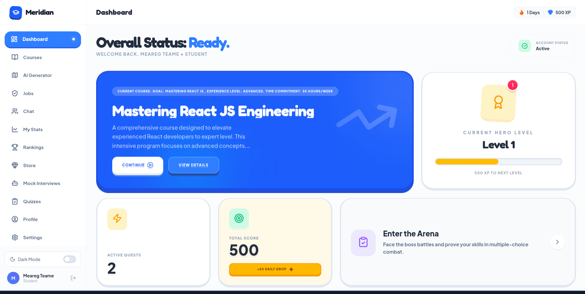</p>

### 2. AI-Powered Dynamic Roadmaps
Tell the AI your exact goal, and it will generate a 4-phase, multi-week learning quest complete with specific technical topics, concepts, and premium resources.
<p align="center">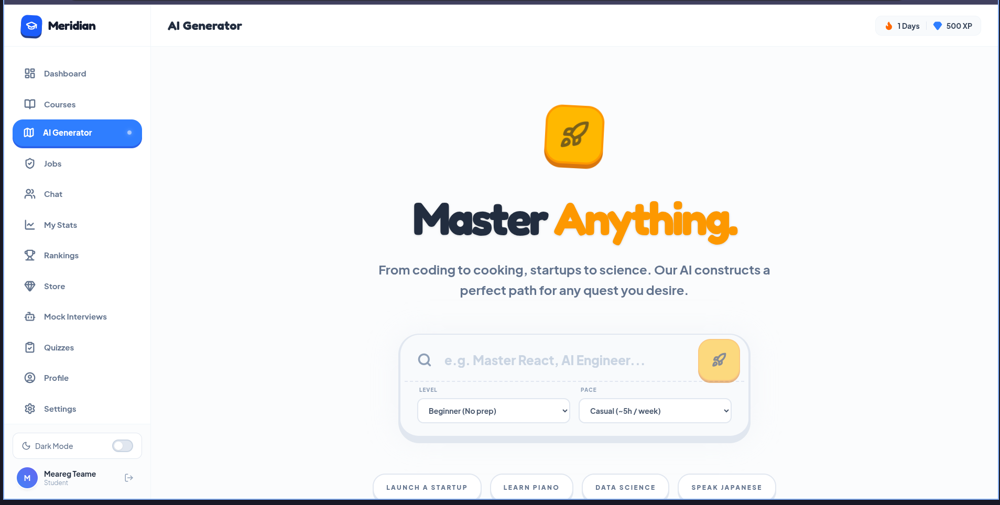</p>

### 3. Quest Log (My Progress)
Check off your learning checkpoints and see your completion percentages jump as you conquer your personalized tech curriculum.
<p align="center">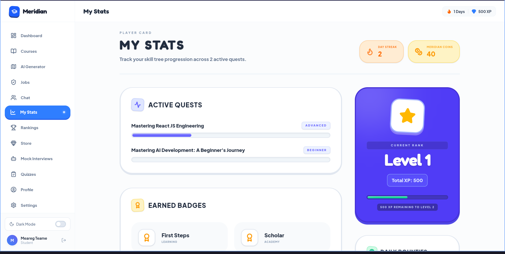</p>

### 4. Interactive Course Generation
Instantly generate entire course syllabuses with zero-latency load times, utilizing Gemini's structured JSON outputs.
<p align="center">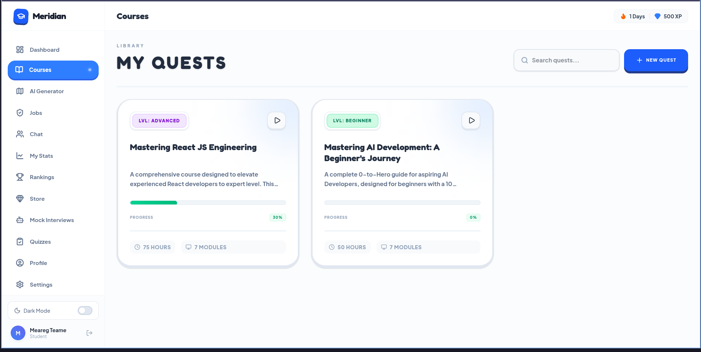</p>

### 5. High-Stakes Mock Interviews
Sit in the hot seat. The AI generates obscure, highly-targeted technical interview questions based on your specific role and difficulty level. 
<p align="center">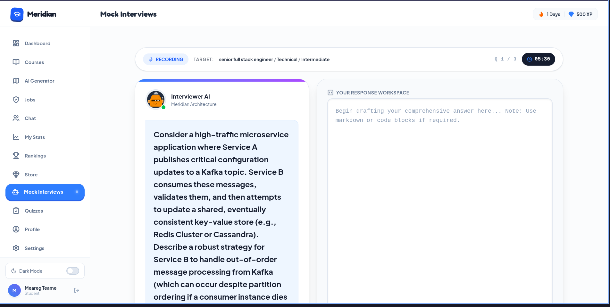</p>
<p align="center">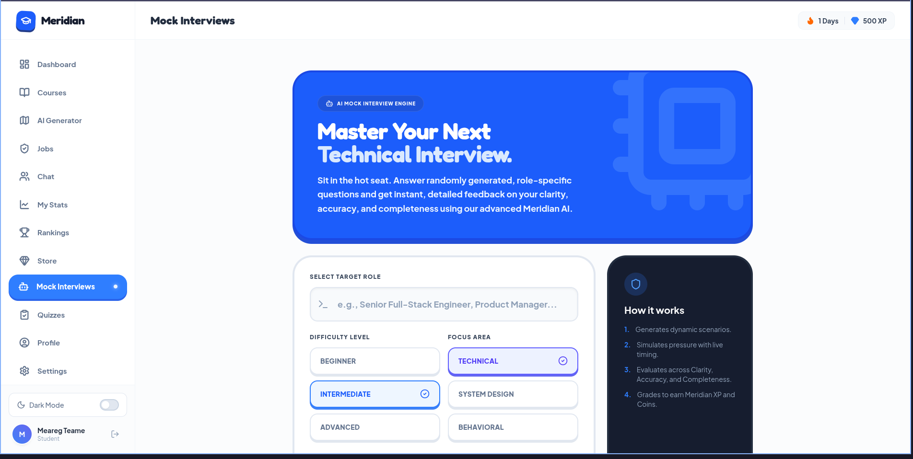</p>

*^ The AI acts as a ruthless evaluator, strictly grading your answer out of 10 based on Clarity, Technical Accuracy, and Completeness, pointing out exactly what edge-cases you missed.*

### 6. The Proving Grounds (Quizzes)
Auto-generate intense multiple-choice technical quizzes on any niche topic to validate your knowledge dynamically.
<p align="center">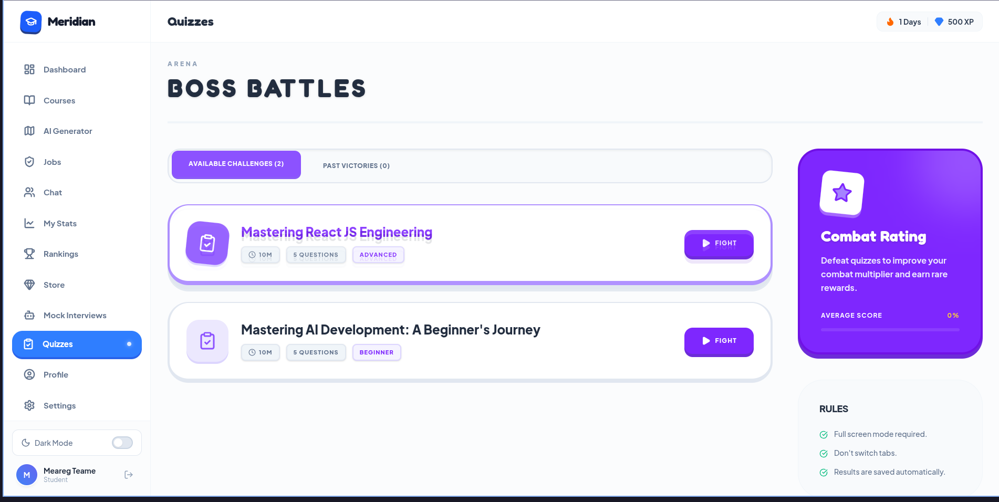</p>

### 7. Global Leaderboards
Compete against your peers globally by earning XP from completing courses, passing mock interviews, and holding your daily coding streaks.
<p align="center">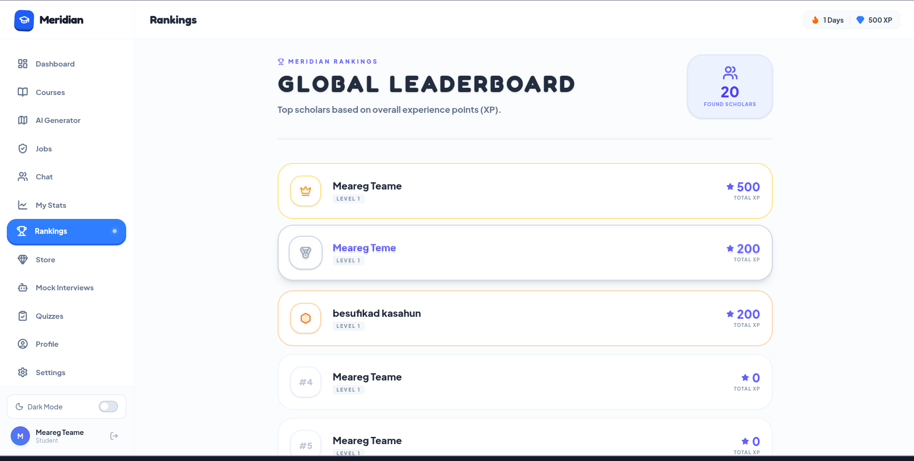</p>

### 8. Live Job Board & Market Insights
Browse matching hybrid and remote job roles synced natively with the tech stack paths you are actively learning.
<p align="center">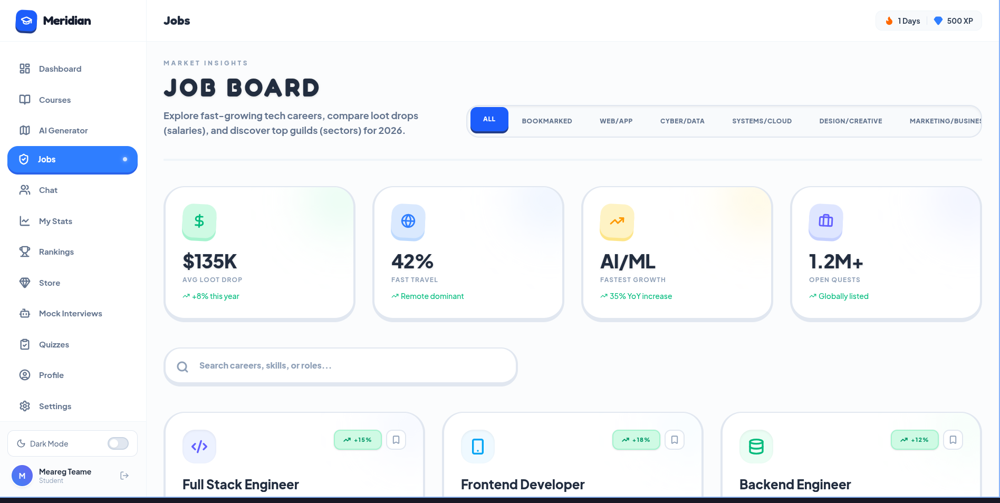</p>

### 9. Community Guilds (Chat)
Hang out with other learners, ask technical questions, and collaborate in real-time through the Supabase-powered global chat channels.
<p align="center">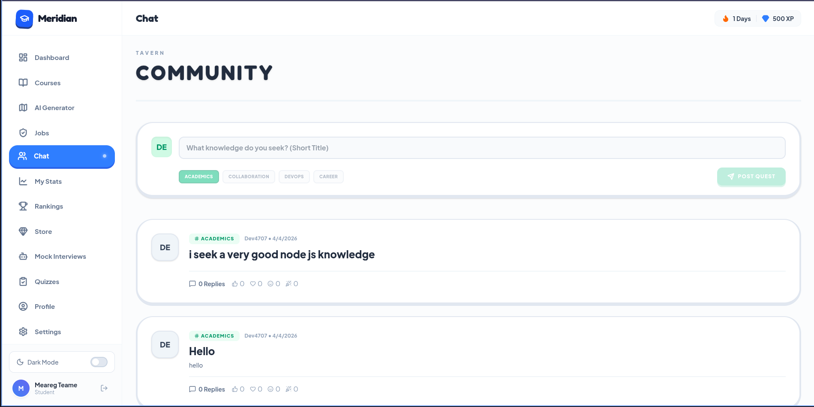</p>

### 10. The Marketplace
Spend your hard-earned gems and XP points on profile badges, theme unlocks, and dark-mode aesthetics.
<p align="center">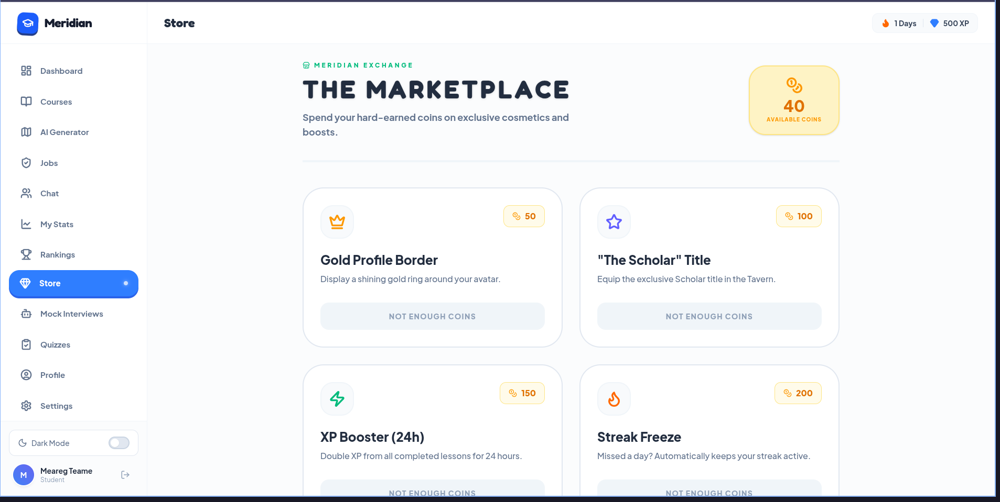</p>

### 11. Profile & Settings
Configure your user parameters, track your exact stats, and personalize your neo-brutalist presence.
<p align="center">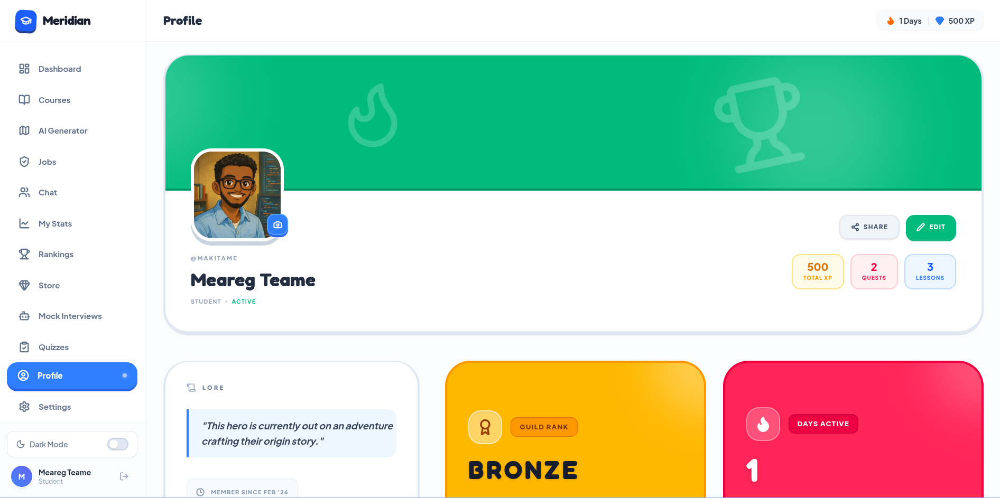</p>
<p align="center">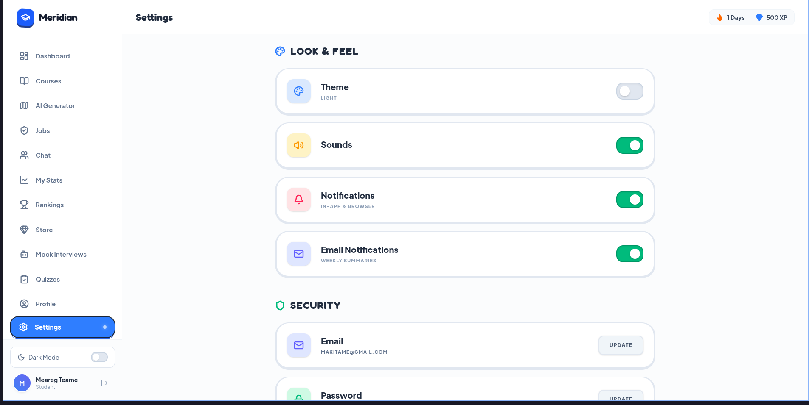</p>

---

## 🚀 The Tech Stack Data Flow

Meridian is built to scale instantly using modern, bleeding-edge architectures:

1. **Vite + React (TypeScript):** Lightning-fast hot module reloading paired with strict type-safety for zero-runtime crash guarantees.
2. **Google Gemini API (`2.5-flash`):** Responsible for 100% of the dynamic generation. Uses `application/json` schema forcing combined with an exponential backoff retry wrapper to handle `429 Quota` limits safely.
3. **Supabase (PostgreSQL):** The core nervous system handling the heavy lifting of user sessions (Google OAuth), Real-time Chat subscriptions, XP tracking, and Roadmap storage.
4. **Tailwind CSS:** Fully customized neo-brutalist styling (heavy box-shadows, sharp borders, bold contrasting variable color themes).

---

## ⚡ Quick Start Deployment

Want to run the game locally?

### 1. Clone & Install
```bash
git clone https://github.com/Meargteame/careerguide-ai.git
cd careerguide-ai/frontend
npm install
```

### 2. Environment Variables
Create a `.env` in the `frontend` directory:
```env
VITE_SUPABASE_URL="https://your-project.supabase.co"
VITE_SUPABASE_ANON_KEY="your-anon-key"
VITE_GEMINI_API_KEY="your-gemini-key"
```

*Note: For the Supabase database structure, run the provided SQL migration files (`SUPABASE_MIGRATION_*.sql`) in your Supabase SQL Editor.*

### 3. Launch
```bash
npm run dev
```

Your AI-powered career portal is now live at `http://localhost:3000`.

---

## 🛡️ License & Contributions
MIT Licensed. Pull requests, issues, and optimizations are fully welcome. Expand the map. Build new quests. Add harder boss fights.
