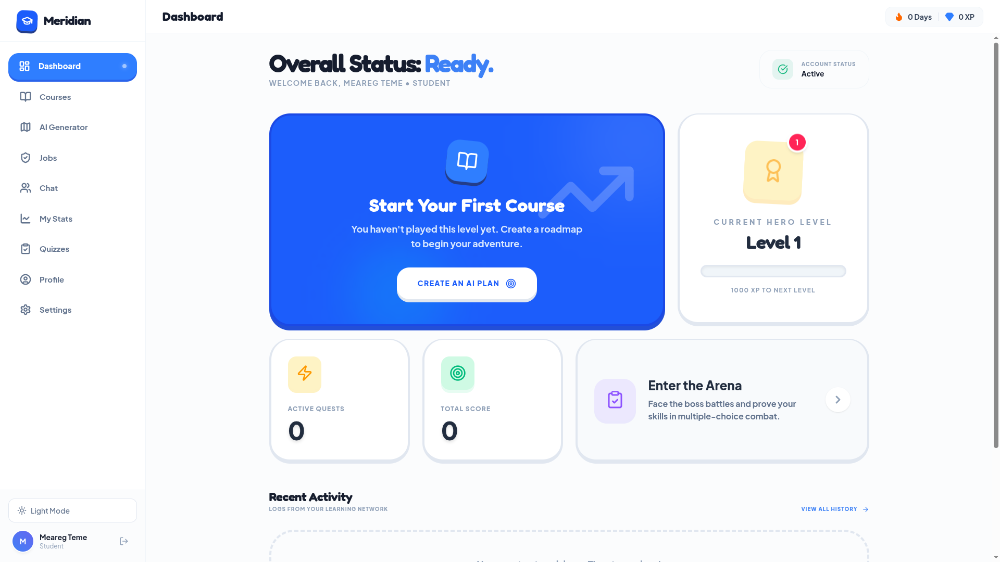
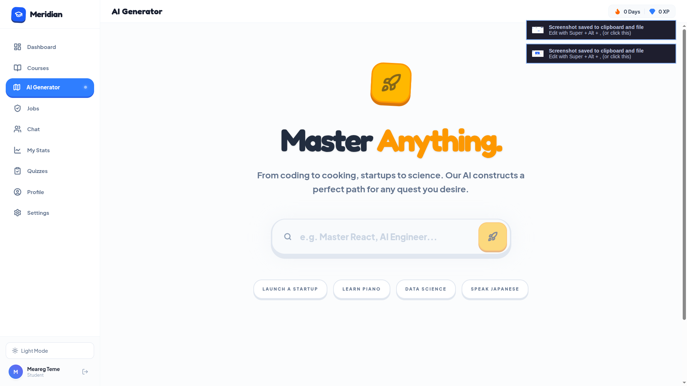
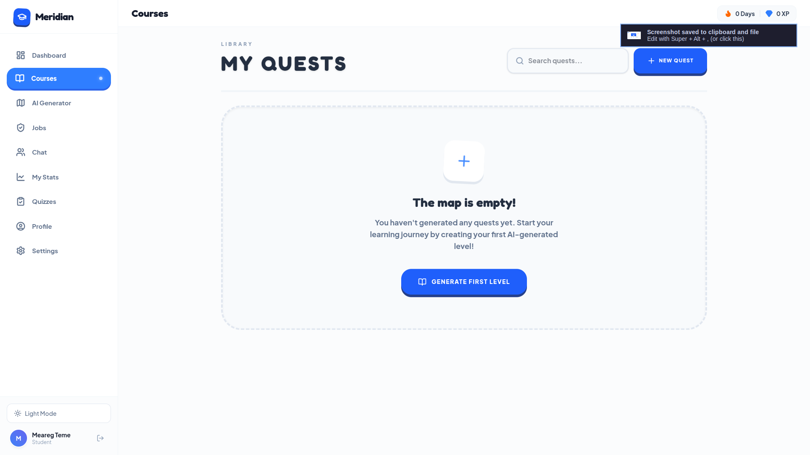
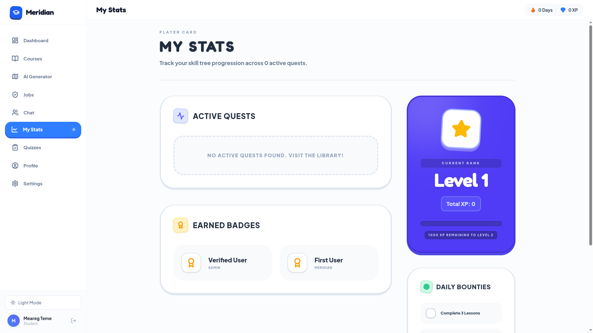
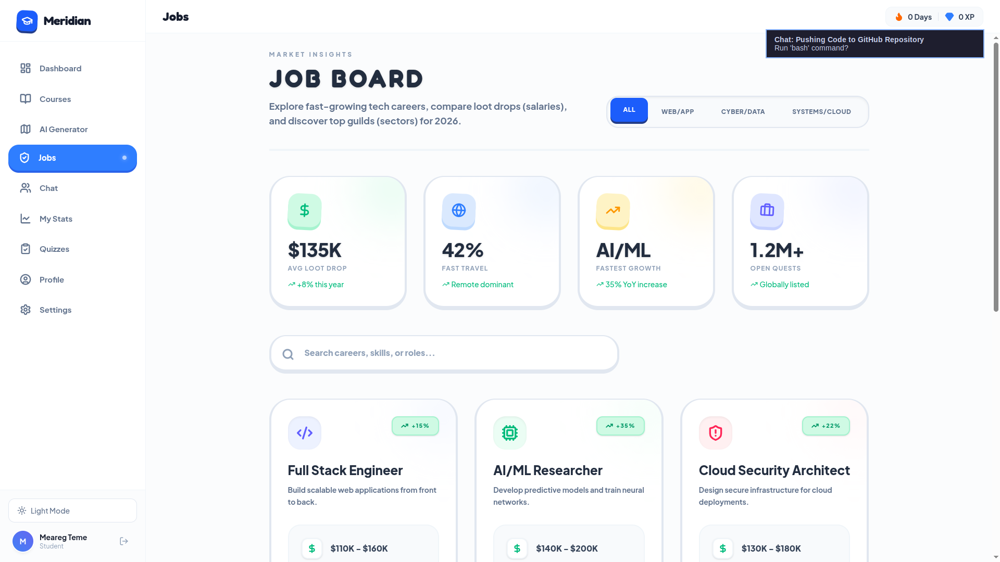

# Meridian 🧭

**The Intelligent Career Layer.**
Meridian is an immersive, gamified web application designed to help students and professionals explore tech careers, generate AI-powered roadmaps, and level up their skills through quests and interactive learning.

---

## 📸 Sneak Peek

### Dashboard & Overview


### AI-Powered Roadmaps (My Plan)


### Interactive Courses


### Gamified Quests & Progress


### Job Market Insights


---

## 🎮 Core Features

- **AI Career Generator:** Generate personalized, step-by-step career roadmaps using Google's Gemini AI.
- **Gamified Design:** A striking neo-brutalist UI with bold colors, thick borders, and satisfying interactions.
- **Progress Tracking:** Track XP, maintain learning streaks, and collect badges as you level up your skills.
- **Library & Quests:** Access expert videos, documentation, courses, and interactive challenges.
- **Market Insights:** Real-time job market connections matched to your active goals.

## 🛠️ Technologies Used

- **Frontend Core:** React, TypeScript, Vite
- **Styling:** Tailwind CSS
- **Backend & Auth:** Supabase
- **AI Integrations:** Google Gemini
- **Icons & Assets:** Lucide React

## 🚀 Quick Start

### Prerequisites
- Node.js (v18+)
- A Supabase project
- A Google Gemini API Key

### Installation

1. **Clone the repository:**
   ```bash
   git clone https://github.com/Meargteame/careerguide-ai.git
   cd careerguide-ai/frontend
   ```

2. **Install dependencies:**
   ```bash
   npm install
   ```

3. **Configure Environment:**
   Create a `.env` file based on instructions in `SUPABASE_SETUP.md` & `README_GOOGLE_AUTH.md`:
   ```bash
   VITE_SUPABASE_URL=your_supabase_url
   VITE_SUPABASE_ANON_KEY=your_supabase_anon_key
   VITE_GEMINI_API_KEY=your_gemini_api_key
   ```

4. **Start the development server:**
   ```bash
   npm run dev
   ```

## 🤝 Contributing
Contributions, issues, and feature requests are welcome!

## 📝 License
This project is licensed under the MIT License.
